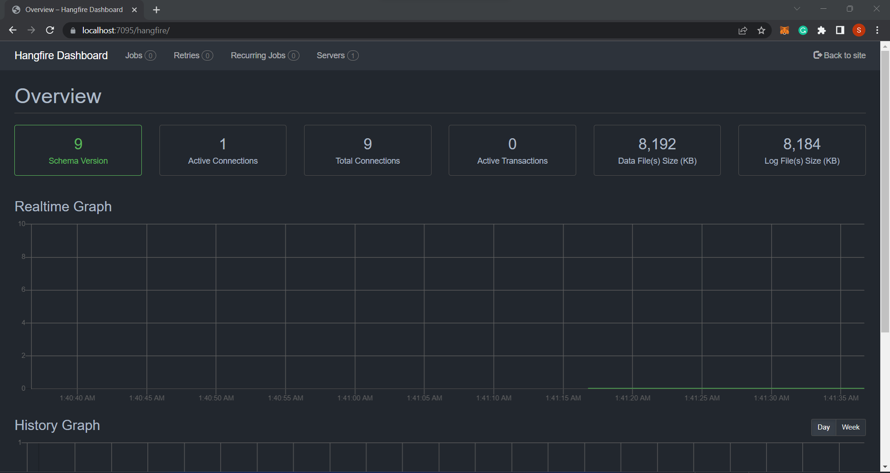
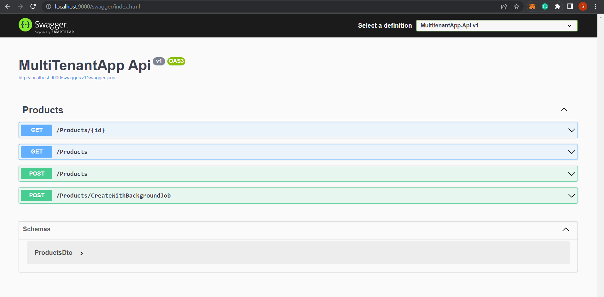

# MultitenantPractice

## Run new Migrations
```cs
dotnet ef migrations add InitialMigration --project ".\Infrastructure\" --startup-project ".\MultitenantApp.Api\"
```

## Run docker

The command below runs the db only

```
docker compose -f .\docker-compose.yml -f .\docker-compose.override.yml up -d db
```

To run all containers

```
docker compose -f .\docker-compose.yml -f .\docker-compose.override.yml up -d
```

To Stop all Containers
```
docker compose down
```

For Hangfire to Run, manually create hangfire db with the following command

```
create database MultiTenantHangfireDb
go
```

## Endpoints


* ** Hangfire -> [http://localhost:9000/hangfire](http://localhost:9000/hangfire)


* **MultiTenantAPI URL -> [http://localhost:9000/swagger](http://localhost:9000/swagger)**
